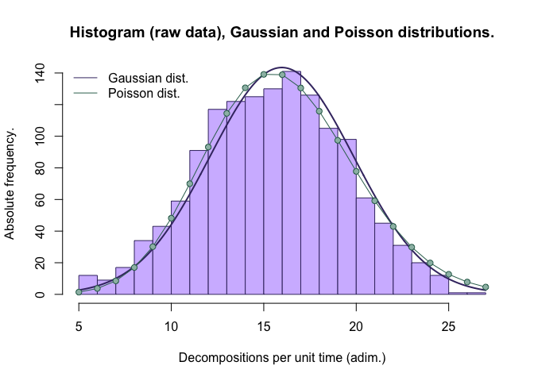

We need some data corresponding to nuclear decay. Since the raw data I
could gather in the laboratory is not enough to get a nice-looking
Gaussian distribution (and I want this to be somewhat easy to understand
for most people), I generated a .CSV file with data corresponding to a
normal distribution, with N=1400, mean=16 and standard deviation=4. For
large N values, a Poisson distribution tends towards a Gaussian
distribution, so this will be fine. We import the
file:

``` r
data = read.csv("https://raw.githubusercontent.com/malmriv/radiohistogram/master/normdist.csv")
```

And extract the useful information. The “time” column indicates how many
minutes have passed since the measurement started, and the
“decompositions” column indicate the number of detected decays during
that minute. Therefore:

``` r
decomp = data$decompositions
```

Then, we define a function to plot the data. Note that my intention is
not to perform a proper analysis. I just want to graph the data in
histogram form, and check how well it fits a normal and a Poisson
distribution. The function, which I think is self explanatory, looks
like this:

``` r
histogram = function(x) {
    
    #We create the histogram itself.
    h = hist(x,border=rgb(0.255,0.2,0.439),col=rgb(0.822,0.738,1),xlab="Decompositions per unit time (adim.)",ylab="Absolute frequency.",main="Histogram (raw data), Gaussian and Poisson distributions.",breaks=as.integer(seq(min(x),max(x),1)))
    
    
    #With the mean and s.d. of the raw data, we generate the two distributions
    #Gaussian:
    xfit = seq(min(x),max(x),length=1000)
    yfit = dnorm(xfit,mean=mean(x),sd=sd(x))
    yfit = yfit*sum(h$counts)
    #And Poisson:
    xpois = as.integer(seq(min(x),max(x),1))
    ypois = dpois(xpois,mean(x))
    ypois = ypois*sum(h$counts)
    
    #We plot the distributions
    lines(xfit,yfit,col=rgb(0.255,0.2,0.439),lwd=2)
    lines(xpois,ypois,type="o",pch=21,col=rgb(0.216,0.439,0.369),bg=rgb(0.612,0.737,0.698))
    
    #And also add a nice legend (since it is not immediately obvious which line corresponds to what):
    legend("topleft", legend=c("Gaussian dist.","Poisson dist."),col=c(rgb(0.255,0.2,0.439),rgb(0.216,0.439,0.369)),lty=1,bg="transparent",box.lty = 0)
}
```

Our result:

``` r
histogram(decomp)
```

<!-- -->

As expected, the histogram resembles a Poisson distribution, which is
also close to the corresponding Gaussian distribution.
